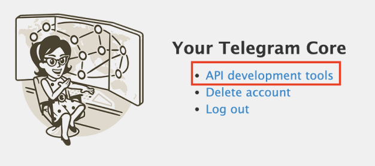
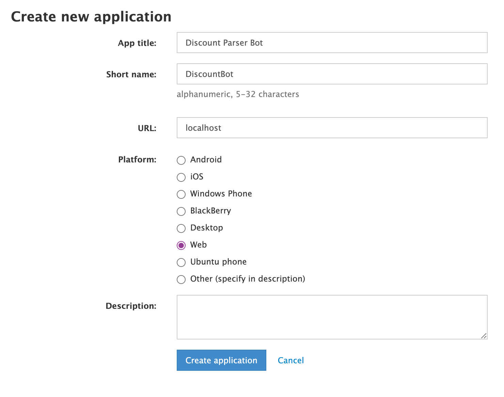

## ✡️ Бот-фильтр для отслеживания постов в скидочных Telegram-каналах

### О проекте

В Telegram-каналах, таких как "Записки Еврея", часто встречаются выгодные предложения на маркетплейсах: от "RTX 4090 по цене доширака" до редких скидок на популярные товары. Однако найти действительно интересные предложения среди десятков постов с бытовыми товарами, игрушками и прочими, не всегда актуальными позициями — задача не из простых. Кроме того, горячие скидки обычно действуют недолго, и их можно легко пропустить.

**Этот бот решает проблему!**

С помощью системы парсинга бот отслеживает все новые посты в популярных скидочных Telegram-каналах и уведомляет вас **только** о тех товарах, которые соответствуют вашим интересам. Вы можете настроить фильтр по ключевым словам и получать уведомления именно по тем предложениям, которые вам важны, сразу со всех популярных каналов, публикующих обзоры и скидки.

### Преимущества:

- 📲 **Экономия времени**: больше не нужно вручную просматривать десятки постов в поисках выгодных предложений.
- 🎯 **Точечные уведомления**: получайте только те предложения, которые соответствуют вашим интересам и ключевым словам.
- ⚡ **Моментальное уведомление**: бот отправит вам сообщение сразу после появления подходящей скидки, чтобы вы успели воспользоваться предложением.
- 🌐 **Широкий охват**: бот собирает информацию со всех популярных скидочных Telegram-каналов.

### Как это работает:

1. Вы задаете список ключевых слов (например, "RTX 4090", "iPhone", "LEGO").
2. Бот начинает мониторить посты из популярных скидочных каналов.
3. При обнаружении подходящего предложения бот сразу же уведомляет вас, пересылая пост.

Таким образом, вы получаете доступ только к интересующим вас скидкам и больше не пропускаете горячие предложения.

## Установка:

Убедитесь, что на вашей системе установлен Docker и Docker-compose. 
```bash
docker --version
docker compose version
```
Если Docker еще не установлен, следуйте [инструкции по установке Docker](https://docs.docker.com/engine/install/).

Затем клонируем репозиторий через:
```bash
git clone https://github.com/Alex00999/DiscountParserBot.git
```

Для работы бота потребуется создать **отдельный (твинк)** Telegram-аккаунт. Это необходимо для обеспечения безопасности и минимизации рисков, связанных с возможной блокировкой основного аккаунта.

На аккаунте необходимо будет **подписаться** на все интересующие вас телеграм-каналы и удалить лишние.

Для работы с API Telegram через Telethon нам необходимо получить `api_id` и `api_hash`. Сделать это можно в разделе [инструментов разработчика Telegram](https://my.telegram.org/auth?to=apps).

Перейдите по ссылке и авторизуйтесь, используя номер телефона, привязанный к профилю. В Telegram вам придет код. После авторизации необходимо выбрать пункт API development tools:



В открывшейся форме заполните пустые поля. Всё заполнять необязательно, главное — указать полное и краткое имя приложения:



После нажатия `Create application` откроется страница, на которой нас интересует **api-id** и **api-hash**. Их необходимо скопировать в файл `.env`.

Для работы основного aiogram бота нам также понадобится токен от [BotFather](t.me/BotFather), его также необходимо вставить в `.env`.

Теперь необходимо сгенерировать файл `telethon_parser.session`. Для этого запустите `bot.py`; после этого вам снова придет код, который потребуется ввести в консоль. После этого файл сессии будет сгенерирован, и вводить код больше не потребуется.

Зайдите в папку с проектом, соберите образ и запустите контейнер:
```bash
docker compose up -d --build
```

После этого бот подключит БД и начнет отвечать на сообщения.

Чтобы остановить бота:
```bash
docker compose down
```

Если возникают проблемы с `docker compose`, попробуйте вместо нее использовать команду `docker-compose`.
